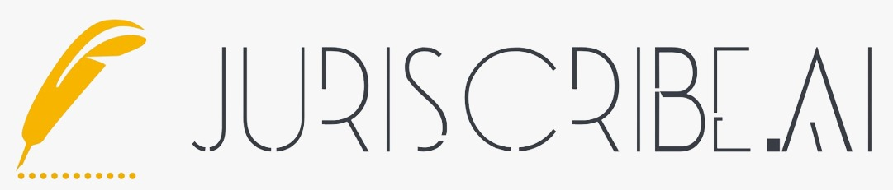

<h1 align="center">Team 23 🚀</h1>

<h2 align="center">Problem Statement Title: A.I. Powered Legal Documentation Assistant</h2>
<h1 align="center">Juriscribe.ai 📜</h1>


<p align="center">AI-powered legal documentation assistant designed to simplify the process of <b>creating legal documents using plain and understandable language.</b> It streamlines the often complex and time-consuming task of legal paperwork by providing a user-friendly interface that guides users through the document creation process. Juriscribe prioritizes data security, ensuring that sensitive legal information remains confidential. Whether you need to draft contracts, agreements, or other legal documents, Juriscribe makes the process easier and more accessible, even for individuals without legal expertise, where we target our best and try to give our best.</p>

<h2>Our two main features Juri And Scribe</h2>


### Juri: Legal Guidance Assistant 📚
- Instant legal help 🚀
- Simplify complex legal matters 🔍

### Scribe: Document Creation Made Easy ✍️
- Effortless document drafting 📄
- Plain language translation of legal jargon 📝


<h2 align="center">Technology Used 💻 </h2>

- **AI and ML** : We use an adaptable LLM-powered model for text generation and classification, multilingual question answering, and transforming user responses into documents via **PDFKit** and **wkhtml**.
- **Blockchain** : We utilized **Solidity** to develop a contract on the **Ethereum** and employed **Pinata** for storing documents on an **IPFS** network.
- **Frontend** : We leveraged the power of **Tailwind** and **Next.js** to meticulously design an exceptionally user-friendly front-end experience.
- **Backend** : We leveraged **Node.js** and **Express** for the backend, relied on **MongoDB** for data storage, and turned to **Flask** to establish a robust server for hosting our advanced machine learning model.

<h2 align="center">Tech Stack 💻</h2> 
<div align="center">

 

 

 

 


</div>


<h2 align="center">Use Cases 📋</h2>

- **Simplified Language Conversion**: Transform complex legal terminology into clear, understandable language.

- **Time and Cost Efficiency**: Optimize document creation, review, and storage, resulting in reduced time and lower legal expenses.

- **Proficient Legal Guidance**: Access expert advice on a wide range of legal issues through a dedicated legal support service.

- **Customizable Document Templates**: Create clear and consistent documents with personalized templates.

- **Enhancing Clarity**: Empower individuals and small businesses to confidently navigate legal documentation by eliminating barriers to legal understanding.

<h2 align="center">Showstoppers 🚫</h2>

- **Legal Accuracy Challenge**: Ensuring AI-generated documents are legally accurate and up-to-date is critical.

- **User Trust and Education** :Building user trust and ensuring effective AI adoption may pose challenges.

- **Ethical Considerations**: Ensuring that the AI system adheres to ethical standards in the legal profession, such as client confidentiality and conflict of interest, is crucial. 

<h2 align="center">Configuration</h2>

Before proceeding, please verify that Node.js and npm (Node Package Manager) are installed on your computer. You can confirm this by executing the following commands in your terminal:
    ```
    node -v
    npm -v
    ```

   > [Node.js Documentation](https://nodejs.org/en/docs/)

<h2 align="center">Installation</h2>

1. Clone the News-Unchained project from GitHub:

    ```
    git clone https://github.com/ITER-SIH/Team-23.git
    ```

2. Once the project is cloned, navigate into the project directory and run the following command to install all the necessary dependencies:

    ```
    npm install
    ```

    ```
    cd frontend/
    npm install
    ```

3. Finally, to start the development server, run the following command in your terminal (in the root):

    ```
    npm run dev
    ```

   > This will start the development server, and you should be able to see your project running at [http://localhost:3000](http://localhost:3000) in your browser.


<h2 align="center">Contributors 👥</h2>

[](https://github.com/UditaRaj11)
[](https://github.com/MrSnor)
[](https://github.com/pragatisaikia)
[](https://github.com/psuhani1804)
[](https://github.com/aks007837)
[](https://github.com/RIYAN1-ux)
